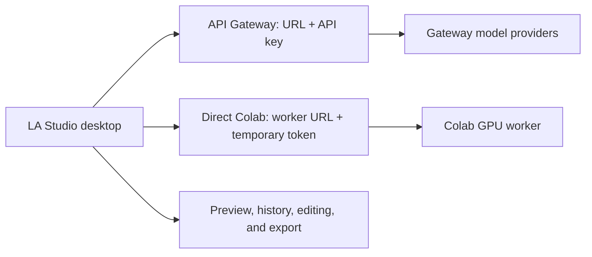

<div align="center">


<h1>LA Studio</h1>

<p><strong>Remote-first AI Audio Studio for Speech-to-Text, Text-to-Speech, Voice Cloning, Voice Design, Translation, and Video Dubbing</strong></p>

<p>
Run AI audio workflows through an API Gateway or a direct, temporary Colab GPU worker from one native C++/Qt desktop app. Local Dev remains available only as an explicit development option.
</p>

[Features](#features) |
[Screenshots](#screenshots) |
[Use Cases](#use-cases) |
[Supported Models](#supported-models-and-runtimes) |
[Build](#build-from-source) |
[Architecture](#architecture) |
[Roadmap](#roadmap) |
[Acknowledgements](#acknowledgements)

<br>

[](https://www.gnu.org/licenses/agpl-3.0.html)
[](https://www.facebook.com/groups/lastudio.community.vn)
[](https://m.me/ch/AbZaLPyeBxvQ_kLb/)
[](https://discord.gg/aybynNyCP)
<!--
[](https://en.cppreference.com/w/cpp/compiler_support/17)
[](https://www.qt.io/)
[]()
[]()
-->

<br>
<br>


</div>

---

## Project Updates

### 2026-07-28 - Internal build numbering

Internal packages now use four numeric fields: `MAJOR.MINOR.RELEASE.BUILD`. The first remote-first package is `0.0.0.1`; increment the fourth field for each build (`0.0.0.2` through `0.0.0.9`), then roll to `0.0.1.0`. The same number is embedded in the app, Windows file metadata, installer, staging manifest, and release tag.

### 2026-07-28 - Remote-first inference

Heavy inference can now use either an API Gateway or a direct Colab GPU worker. These routes are isolated: they use separate credentials, sessions, model catalogs, errors, and requests; neither route forwards to or falls back to the other. Remote-first mode blocks automatic local model downloads and local inference until Local Dev is explicitly enabled.

### 2026-07-23 - Version 0.2.0: Video Dubbing

LA Studio version 0.2.0 introduces **Video Dubbing**, an end-to-end local workflow for translating and replacing speech in audio or video. Import media, separate vocals from background audio, transcribe and translate timestamped segments, synthesize the translated dialogue with local voices, review or edit each segment, then mix and export the dubbed result. Automatic and step-by-step workflows keep every stage visible and configurable, while media processing and AI inference remain offline on the user's machine.

### 2026-07-16 - Version 0.1.10: Translation Studio

LA Studio version 0.1.10 introduces **Translation Studio**, a fully local workspace for translating plain text and subtitle files. Import text, SRT, or VTT content; translate an entire project or individual segments; review and edit source and target text side by side; save project history; and export results as text, SRT, VTT, or JSON. The initial model lineup includes M2M-100 and MADLAD-400 through the CrispASR runtime, plus Tencent Hy-MT2 1.8B through llama.cpp, with all translation inference running offline on the user's machine.

### 2026-07-14 - Version 0.1.9: Voice Isolator Support

LA Studio version 0.1.9 begins support for **Voice Isolator**, a local source-separation workflow for extracting vocal and background stems from audio or video files. The new studio supports sherpa-onnx separation models, including UVR-MDX-NET Vocals and Spleeter two-stem models, with progress reporting, waveform previews, playback, and stem export. Processing remains fully offline on the user's machine.

### 2026-07-10 - Version 0.1.8: VieNeu-TTS v3 Upstream Update

LA Studio version 0.1.8 updates **[VieNeu-TTS-v3-Turbo](https://huggingface.co/pnnbao-ump/VieNeu-TTS-v3-Turbo)** support to follow the latest changes from the original author, including updated reference/denoise options and improved native runtime integration. This release also improves TTS cancellation, audio playback controls, model setup guidance, and backend thread management.

### 2026-07-03 - Version 0.1.7: Kokoro Vietnamese Support

LA Studio version 0.1.7 now supports Vietnamese text-to-speech using the fine-tuned Kokoro-82M model. Special thanks to the author **iamdinhthuan** for the original **[Kokoro-Vietnamese](https://github.com/iamdinhthuan/Kokoro-Vietnamese)** repository and model training.

### 2026-07-01 - VieNeu-TTS-v3-Turbo Support

LA Studio now supports **[VieNeu-TTS-v3-Turbo](https://huggingface.co/pnnbao-ump/VieNeu-TTS-v3-Turbo)**, a high-fidelity 48 kHz Vietnamese-English text-to-speech model by Pham Nguyen Ngoc Bao. Integrated via the native `VieNeu-TTS.cpp` runtime, it offers hardware acceleration (CPU, CUDA, Vulkan) and real-time progress tracking. The entire pipeline runs completely offline on your hardware to ensure data privacy.

### 2026-06-23 - Nemotron-3.5 Streaming ASR

LA Studio now supports NVIDIA **Nemotron-3.5 ASR Streaming 0.6B** for local multilingual speech-to-text through CrispASR. The Model Gallery can download the Q4_K or F16 GGUF model and compatible CrispASR v0.8.4 CPU, CUDA, or Vulkan runtime packages.

## Overview

LA Studio is a desktop AI audio workstation for creators, developers, researchers, and teams. Its default Remote-first mode keeps the desktop client lightweight while it runs heavy inference through a selected API Gateway model or a selected direct Colab GPU worker.

Gateway and Colab are independent paths: the Gateway uses its own URL and encrypted API key, while Colab uses an in-memory worker URL and temporary bearer token. Neither route carries traffic, credentials, model state, or fallback behavior for the other. The app also retains an explicit Local Dev mode for offline development and comparison.

## Features

| Feature | What it does | Remote execution |
| --- | --- | --- |
| Speech-to-Text Studio | Transcribe microphone input or audio files into text. | API Gateway STT or direct Colab GPU |
| Text-to-Speech Studio | Generate natural speech from text with configurable parameters and audio preview. | API Gateway TTS or direct Colab GPU |
| Voice Cloning | Create speech from a reference voice sample. | Direct Colab GPU worker |
| Voice Design | Generate or shape voices from descriptive prompts. | Direct Colab GPU worker |
| Voice Isolator | Separate vocals and background audio into two stems. | Direct Colab GPU worker |
| Forced Alignment | Align transcript segments to audio timestamps. | Direct Colab GPU worker |
| Translation Studio | Translate and edit text, SRT, and VTT projects. | API Gateway or direct Colab GPU |
| LLM Chat | Chat with a selected language model. | API Gateway or direct Colab GPU |
| Video Dubbing | Transcribe, translate, synthesize, mix, and export dubbed audio or video. | Selected remote provider for each inference stage |
| Models Gallery | Browse remote catalogs or explicitly manage Local Dev assets. | Separate Gateway and Colab catalogs |
| Native Desktop UI | Use a responsive Qt Quick interface with audio input controls, waveform previews, history, settings, and logs. | C++17 + Qt 6/QML |

## Screenshots

| Home | Models Gallery |
| --- | --- |
|  |  |

| Speech-to-Text | Text-to-Speech |
| --- | --- |
|  |  |

| Voice Cloning | Voice Design |
| --- | --- |
|  |  |

| System Logs |
| --- |
|  |

## Use Cases

- Run private speech transcription locally for interviews, meetings, research recordings, podcasts, and voice notes.
- Generate local voiceovers for video, learning content, prototypes, narration, and accessibility workflows.
- Dub videos locally by translating dialogue, generating replacement speech, preserving background audio, and exporting the finished media.
- Translate scripts and subtitles locally, review bilingual segments, and export results without sending content to a cloud service.
- Test multiple open speech and audio models from a single desktop interface.
- Build and validate model catalogs, runtime packages, and Hugging Face download flows.
- Experiment with voice cloning and voice design without relying on external inference APIs.
- Develop C++/Qt integrations for local AI audio workflows.

## How LA Studio Works



1. Configure either the API Gateway or a direct Colab worker for the feature you want to run.
2. Select a model from that route's own catalog; the two catalogs are not merged.
3. Run the request directly against the selected route and review output locally.
4. Disable Remote-first mode only when deliberately using Local Dev models and runtimes.

## Supported Models and Runtimes

LA Studio is catalog-driven, so supported models can evolve without rewriting the core UI. Current catalog families include:

| Category | Example model families |
| --- | --- |
| Speech-to-Text | Whisper, Qwen3-ASR 0.6B, Qwen3-ASR 1.7B |
| Text-to-Speech | Kokoro 82M, VibeVoice Realtime, VieNeu-TTS v2 Turbo, VieNeu-TTS v3 Turbo, Qwen3-TTS |
| Voice Cloning | VoxCPM2, OmniVoice, Qwen3 custom voice packages |
| Voice Design | VoxCPM2 voice design, Qwen3 voice design packages |
| Translation | M2M-100 418M, MADLAD-400 3B, Tencent Hy-MT2 1.8B |

Runtime support is handled through native adapters and dynamic libraries. Depending on model availability and platform support, LA Studio can use CPU, CUDA, Vulkan, and other runtime-specific acceleration paths.

## Technology Stack

- **Language:** C++17
- **UI:** Qt 6, Qt Quick, QML, Qt Quick Controls
- **Build:** CMake, Ninja, CMake presets
- **Dependencies:** vcpkg manifest mode, libcurl
- **Audio:** Qt Multimedia, WAV utilities, waveform provider, audio recorder, audio player
- **Model sources:** Local catalog data and Hugging Face download sources
- **Architecture:** MVVM-style QML/C++ controller layer with dynamic AI runtime backends

## Project Structure

```text
LA-Studio/
|-- CMakeLists.txt              # Top-level CMake build configuration
|-- CMakePresets.json           # Build presets
|-- vcpkg.json                  # C++ dependency manifest
|-- catalog-src/                # Source catalog data for model families
|-- data/                       # Generated runtime catalog and schema
|-- examples/                   # Prompt and settings examples for model testing
|-- notebooks/                  # Direct CUDA-only Colab workers, shipped with packages
|-- docs/                       # Public documentation
|   |-- BUILD.md                # Windows build guide
|   |-- README.md               # Documentation index
|   `-- screenshots/            # Product screenshots for this README
|-- include/runtimes/           # Runtime interface headers
|-- qml/                        # Qt Quick user interface
|   |-- Main.qml
|   |-- Theme.qml
|   |-- pages/
|   `-- components/
|-- scripts/                    # Bootstrap, build, test, package, and catalog scripts
|-- src/                        # C++ application source
|   |-- audio/
|   |-- alignment/              # Alignment domain and workflow resolver
|   |-- controllers/            # QML/application adapters grouped by feature
|   |   |-- app/
|   |   |-- alignment/
|   |   |-- dubbing/
|   |   |-- models/
|   |   |-- separation/
|   |   |-- shared/
|   |   |-- stt/
|   |   |-- translation/
|   |   `-- tts/
|   |-- core/
|   |-- dubbing/                # Dubbing project, media, and feature workflows
|   |-- stt/
|   `-- tts/
`-- tests/                      # Unit tests and mocks
```

## Build From Source

The primary development path is Windows with MSVC 2022, Qt 6, CMake, Ninja, and vcpkg.

### Prerequisites

- Visual Studio 2022 or Build Tools with the MSVC x64 toolchain
- Qt 6.5+ with the `msvc2022_64` kit
- CMake 3.21+
- Ninja
- Git

### Quick Start

```powershell
git clone https://github.com/dduongtrandai/LA-Studio.git
cd LA-Studio
.\scripts\bootstrap.bat
```

After a successful release build, run:

```powershell
.\out\build\windows-msvc-release\LA Studio.exe
```

For a faster development build that skips deployment:

```powershell
.\scripts\bootstrap.bat -SkipDeploy
```

For an explicit Qt path:

```powershell
.\scripts\bootstrap.bat -QtRoot C:\Qt\6.9.3
```

For detailed setup, troubleshooting, and preset notes, see [docs/BUILD.md](docs/BUILD.md).

## Testing

Run the test script from the repository root:

```powershell
.\scripts\run_tests.bat
```

The `tests/` directory includes focused coverage for remote route isolation, Gateway and Colab contracts, CUDA-only notebook contracts, model path migration, model and runtime flows, audio preview behavior, file access, history, and STT session logic.

## Architecture

LA Studio uses a QML front end with C++ controllers and core managers. The app keeps model catalog logic, downloads, runtime discovery, hardware checks, audio services, and studio actions behind clear C++ service boundaries.

```text
QML UI
  |
  | Qt properties, signals, and slots
  v
AppController and studio controllers
  |
  | Session state, user actions, model selection
  v
Core services and managers
  |
  | Catalogs, downloads, settings, registry, hardware, logging
  v
Audio services and AI runtimes
  |
  | STT, TTS, voice cloning, voice design backends
  v
Local model files and runtime libraries
```

Key source areas:

- `src/controllers/` bridges QML screens to application services; files are grouped under `app/`, feature, `models/`, and `shared/` boundaries.
- `src/dubbing/` owns dubbing project/media logic and dubbing-specific workflow definitions; the reusable workflow engine remains in `src/workflows/`.
- `src/alignment/` owns alignment-specific domain and workflow resolution logic, while QML-facing alignment adapters remain in `src/controllers/alignment/`.
- `src/core/` manages catalogs, models, downloads, settings, runtimes, registry, hardware, and logging.
- `src/audio/` provides recording, playback, WAV handling, and waveform support.
- `src/stt/` contains speech-to-text engine and backend selection.
- `src/tts/` contains text-to-speech engine, validation, workers, and backend selection.

## Privacy and Execution

Remote-first workloads send input only to the route selected by the user: the configured API Gateway or the paired direct Colab worker. Gateway API keys are stored in the secure Settings store. Colab URLs and tokens are temporary memory-only session values. The application does not relay data between these routes.

Editing, history, waveform display, playback, review, and media export remain on the desktop. Local Dev is available only after it is explicitly enabled. No update is downloaded or installed automatically.

## Documentation

- [Build from Source](docs/BUILD.md)
- [Remote Inference Workers](docs/REMOTE_WORKERS.md)
- [Documentation Index](docs/README.md)
- [Catalog and Local Registry Architecture](docs/architecture/catalog_registry.md)

## Roadmap

- [x] Local speech-to-text studio
- [x] Local text-to-speech studio
- [x] Model gallery and managed downloads
- [x] Runtime and hardware management
- [x] Voice cloning workflow foundation
- [x] Voice design workflow foundation
- [x] Local text and subtitle translation studio
- [x] Independent API Gateway and direct Colab GPU routes for heavy inference
- [ ] Broader cross-platform packaging
- [ ] Expanded model validation and benchmark reporting
- [ ] Advanced timeline-style audio editing
- [ ] Additional local speech-to-speech and multimodal audio workflows

## Community

Use these Facebook channels for discussion, feedback, and suggestions:

- **Facebook Group**: [LA Studio Community](https://www.facebook.com/groups/lastudio.community.vn)
- **Discussion & Feedback Chat**: [Join the Facebook chat](https://m.me/ch/AbZaLPyeBxvQ_kLb/)
- **Discord**: [Join the LA Studio Discord community](https://discord.gg/aybynNyCP)

## Contributing

Contributions are welcome. Good first areas include UI polish, catalog metadata, runtime adapters, tests, documentation, packaging, and model compatibility validation.

Before changing architecture-heavy code, review the public docs in `docs/` and keep implementation changes aligned with the existing controller, service, and runtime boundaries.

## Acknowledgements

LA Studio exists because of the open-source runtime, tooling, and model ecosystems around local speech AI. Thank you to the maintainers and contributors of these projects:

- [whisper.cpp](https://github.com/ggml-org/whisper.cpp) and [OpenAI Whisper](https://github.com/openai/whisper) for local Whisper speech recognition support.
- [CrispASR](https://github.com/CrispStrobe/CrispASR) for GGUF runtime packages used by Qwen3-ASR, Qwen3-TTS, Kokoro, VoxCPM2, and VibeVoice workflows in LA Studio.
- [omnivoice.cpp](https://github.com/dduongtrandai/omnivoice.cpp) and the [k2-fsa / sherpa-onnx](https://github.com/k2-fsa/sherpa-onnx) ecosystem for OmniVoice runtime integration.
- [VieNeu-TTS.cpp](https://github.com/dduongtrandai/VieNeu-TTS.cpp) for VieNeu-TTS runtime integration.
- The model authors and communities behind [Kokoro](https://github.com/hexgrad/kokoro), [Kokoro-Vietnamese](https://github.com/iamdinhthuan/Kokoro-Vietnamese), [Qwen speech models](https://github.com/QwenLM), [VoxCPM2](https://huggingface.co/openbmb/VoxCPM2), [VibeVoice](https://huggingface.co/microsoft/VibeVoice-Realtime-0.5B), [OmniVoice](https://huggingface.co/k2-fsa/OmniVoice), [VieNeu-TTS v2 Turbo](https://huggingface.co/pnnbao-ump/VieNeu-TTS-v2-Turbo), and [VieNeu-TTS-v3-Turbo](https://huggingface.co/pnnbao-ump/VieNeu-TTS-v3-Turbo).

Runtime packages and model files may have their own licenses, terms, and attribution requirements. Please review the upstream project and model licenses before redistributing any bundled runtime or model assets.

## License

LA Studio is free and open-source software under the **GNU Affero General Public License v3.0 only (AGPL-3.0-only)**.

You may use LA Studio for personal, educational, research, internal business, and commercial creative work, including selling audio, voiceovers, dubbing, audiobooks, or other media produced with the app.

AGPL-3.0 is a network copyleft license. If you modify LA Studio and make that modified version available to others, including over a network, you must make the complete corresponding source code of your modified version available under the same AGPL-3.0 terms.

For every released installer, the matching source archive, build instructions, license, notices, and source-offer information are available from the [corresponding GitHub Release](https://github.com/dduongtrandai/LA-Studio/releases).

A commercial license will be available for organizations that want to embed LA Studio, its code, or derivative work in a closed-source or proprietary product or service without the AGPL-3.0 copyleft obligations.

---

**LA Studio helps you run private, local AI audio workflows on your own machine.**

