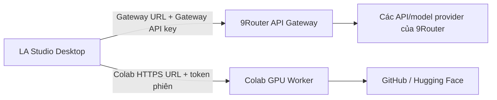

# LA Studio — Kế hoạch chuyển inference sang API Gateway và Colab GPU độc lập

## 1. Mục tiêu

Biến LA Studio thành desktop client nhẹ, không bắt máy người dùng tải và chạy
toàn bộ model nặng từ GitHub/Hugging Face.

Hệ thống có hai đường inference hoàn toàn độc lập:

1. **API Gateway:** LA Studio gọi 9Router để sử dụng các model/provider mà
   9Router đang cung cấp.
2. **Colab GPU:** LA Studio gọi trực tiếp Colab worker của người dùng để chạy
   các model open-source từ GitHub/Hugging Face cần GPU.

Hai đường này không nối với nhau:

- Colab không đăng ký vào 9Router.
- 9Router không quản lý worker, job, token, file hoặc model của Colab.
- Job Colab không đi qua API Gateway.
- LA Studio vẫn dùng được 9Router khi không có Colab.
- LA Studio vẫn dùng được Colab khi không cấu hình 9Router.
- Hỏng một hệ thống không được làm hỏng hệ thống còn lại.

Việc sửa được thực hiện tuần tự theo từng tính năng. Mỗi tính năng phải code,
test và đạt tiêu chí hoàn thành trước khi chuyển sang tính năng kế tiếp.

## 2. Nguồn tham khảo

### 2.1 9Router latest

Dùng để tham khảo:

- API key và bearer authentication.
- `GET /v1/models`.
- `POST /v1/chat/completions`.
- Streaming SSE.
- `POST /v1/audio/transcriptions`.
- `POST /v1/audio/speech`.
- Model/provider routing, combo/fallback, usage và error handling.

Không sửa 9Router thành control plane cho Colab.

### 2.2 Kova

Dùng để tham khảo:

- Desktop kết nối trực tiếp tới Colab worker bằng HTTPS URL và token tạm thời.
- Notebook tự cài dependency, kiểm tra CUDA và từ chối CPU fallback.
- `/health`, `/v1/health`, `/v1/capabilities`.
- OpenAI-compatible transcription.
- Voice profile bằng opaque ID.
- Job queue, progress, cancel và tải artifact trực tiếp giữa desktop và worker.
- One-time pairing và manual URL/token fallback.
- Contract tests cho endpoint, bearer token, multipart và timestamp.

Không đưa gateway của Kova vào giữa desktop và Colab.

### 2.3 LA Studio hiện tại

LA Studio có tám capability:

1. Speech-to-Text.
2. Text-to-Speech.
3. Voice Cloning.
4. Voice Design.
5. Forced Alignment.
6. Voice Isolation.
7. Translation.
8. LLM Chat.

Video Dubbing là workflow ghép nhiều capability trên.

Catalog hiện có 25 họ model:

| Nhóm | Model family |
|---|---|
| STT | `whisper.cpp`, `qwen3-asr-0.6b`, `qwen3-asr-1.7b`, `nemotron-3.5-asr-streaming-0.6b` |
| Translation | `m2m100-418m`, `madlad400-3b-mt`, `hy-mt2-1.8b` |
| Forced alignment | `wav2vec2-aligner-zh`, `canary-ctc-aligner`, `mms-forced-aligner-onnx`, `qwen3-forced-aligner-0.6b` |
| Voice isolation | `sherpa-onnx-spleeter-2stems-fp16`, `sherpa-onnx-uvr-vocals-ft` |
| TTS/voice | Kokoro, OmniVoice, VibeVoice, VoxCPM2, VieNeu và các biến thể Qwen3 TTS |
| LLM Chat | `qwen3.5-2b` |

Các backend hiện tại nhận `modelPath`/`runtimePath` local. Cần thêm remote
backend qua interface/factory hiện có, không chèn HTTP trực tiếp vào từng QML
page hoặc controller.

## 3. Kiến trúc đúng



Không có đường kết nối `GW ↔ CW`.

### 3.1 Hai cấu hình độc lập trong LA Studio

#### API Gateway

- Gateway base URL.
- Gateway API key.
- Test Connection.
- Model list lấy từ `/v1/models`.
- Trạng thái và lỗi riêng.
- API key lưu bằng `SecureCredentialStore`.

#### Colab GPU

- Worker HTTPS URL của phiên hiện tại.
- Bearer token tạm thời.
- Nút mở notebook.
- Pairing một lần hoặc nhập URL/token thủ công.
- Health, CUDA, GPU, VRAM, model/capability.
- URL/token mặc định chỉ nằm trong memory của phiên desktop.
- Khi Colab reset, người dùng pair lại worker mới.

Không dùng chung API key, health status hoặc model list.

### 3.2 Lớp chọn execution provider

Thêm khái niệm:

```text
ExecutionProvider
  - local-dev
  - api-gateway
  - colab-direct
```

Mỗi model/capability entry khai báo rõ:

- `executionProvider`.
- `remoteModelId`.
- `requiredEndpoint`.
- `contractVersion`.
- `supportsStreaming`.
- `supportsProgress`.
- `supportsCancellation`.
- `requiredWorkerProfile` nếu là Colab.

Không suy đoán đường chạy dựa trên tên model.

### 3.3 Module mới trong LA Studio

```text
src/remote/
  gateway/
    GatewayClient
    GatewayModelCatalog
    GatewayChatClient
    GatewaySttClient
    GatewayTtsClient

  colab/
    ColabSession
    ColabPairingClient
    ColabHealthClient
    ColabCapabilityCatalog
    ColabJobClient
    ColabArtifactClient
    ColabVoiceProfileClient

  backends/
    RemoteLlmBackend
    RemoteTranslationBackend
    RemoteSttBackend
    RemoteTtsBackend
    RemoteVoiceBackend
    RemoteAlignmentBackend
    RemoteSeparationBackend
```

Gateway client không import hoặc gọi Colab client. Colab client không import
hoặc gọi Gateway client.

Backend nhận một `ExecutionProvider` đã được resolver chọn và chỉ gọi đúng
client tương ứng.

## 4. Trách nhiệm của từng hệ thống

### 4.1 9Router API Gateway

9Router tiếp tục làm đúng vai trò API router:

- Xác thực API key.
- Trả model/provider đang có.
- Route request.
- Streaming.
- Combo/fallback.
- Usage/quota.
- Chuẩn hóa lỗi.

Các endpoint sử dụng:

| Endpoint | Tính năng LA Studio |
|---|---|
| `GET /v1/models` | Danh sách model API |
| `POST /v1/chat/completions` | LLM Chat và Translation |
| `POST /v1/audio/transcriptions` | STT nếu 9Router có provider tương ứng |
| `POST /v1/audio/speech` | TTS nếu 9Router có provider tương ứng |

Chỉ bổ sung/sửa 9Router khi một endpoint API thực tế còn thiếu contract cần
thiết. Không thêm worker registry, Colab queue hoặc Colab artifact store vào
9Router.

### 4.2 Colab GPU worker

Colab worker tự chứa:

- Model adapter.
- Job queue của chính worker.
- Input upload.
- Progress.
- Cancellation.
- Output artifact.
- Health/capabilities.
- Bearer authentication.

API nền:

| Endpoint | Mục đích |
|---|---|
| `GET /health` | Worker process reachable |
| `GET /v1/health` | CUDA/runtime/model state |
| `GET /v1/capabilities` | Model và capability đang phục vụ |
| `GET /v1/pairing/{code}` | Đổi one-time code lấy token nếu dùng pairing |
| `POST /v2/jobs/{task}` | Tạo job |
| `GET /v2/jobs/{id}` | Progress/result/error |
| `DELETE /v2/jobs/{id}` | Cancel |
| `GET /v2/jobs/{id}/artifacts/{name}` | Tải kết quả |

Các endpoint tương thích có thể giữ:

- `POST /v1/audio/transcriptions`.
- `POST /v1/audio/speech`.
- Voice profile endpoints.

Desktop upload input trực tiếp tới Colab worker và tải output trực tiếp từ
worker. Không upload qua 9Router.

### 4.3 Notebook Colab

Không tạo một notebook chứa mọi dependency. Dùng worker core chung và tách:

- `LA_STUDIO_SPEECH_GPU.ipynb`: STT và forced alignment.
- `LA_STUDIO_VOICE_GPU.ipynb`: TTS, voice cloning và voice design.
- `LA_STUDIO_AUDIO_GPU.ipynb`: voice isolation/source separation.
- `LA_STUDIO_LANGUAGE_GPU.ipynb`: model translation/LLM Hugging Face khi người
  dùng muốn chạy bằng Colab thay cho API Gateway.

Mỗi notebook:

1. Yêu cầu người dùng chọn GPU và Run all.
2. Tạo Python environment cô lập.
3. Cài source/revision đã pin.
4. Kiểm tra CUDA, GPU, VRAM và disk.
5. Từ chối CPU fallback.
6. Khởi động HTTPS tunnel.
7. Sinh bearer token ngẫu nhiên.
8. In URL/token hoặc one-click pairing.
9. Chỉ quảng bá model thực sự cài/nạp được.

## 5. Quy tắc model và lựa chọn đường chạy

### 5.1 Model từ 9Router

Model lấy từ `/v1/models` là model API:

- Hiển thị nhãn `API Gateway`.
- Không cần notebook.
- Không cần tải model local.
- Availability phụ thuộc Gateway.
- Model ID giữ nguyên đúng format 9Router.

### 5.2 Model từ Colab

Model lấy từ `/v1/capabilities` của Colab:

- Hiển thị nhãn `Colab GPU`.
- Chỉ selectable khi worker online và capability compatible.
- Worker trả model ID, source, revision, dtype, VRAM, schema và license.
- Model không online không được giả vờ là ready.

### 5.3 Cùng một tính năng có thể có hai lựa chọn

Ví dụ:

- STT bằng API Gateway hoặc STT bằng Colab.
- TTS bằng API Gateway hoặc TTS bằng Colab.
- Translation bằng model API hoặc model Hugging Face trên Colab.

Hai lựa chọn cùng implement interface của tính năng nhưng có settings và lỗi
riêng. Không tự động nhảy từ Gateway sang Colab hoặc ngược lại nếu người dùng
chưa bật fallback rõ ràng.

### 5.4 Local backend

Trong quá trình chuyển đổi:

- Giữ local backend sau `local-dev` flag để so sánh và rollback.
- Bản remote-first không tự tải model local.
- Nếu nguồn đã chọn offline, báo lỗi đúng nguồn.
- Không âm thầm chạy CPU local.

## 6. Phần giữ lại ở desktop

| Chức năng | Nơi chạy |
|---|---|
| UI/QML, settings, history | Desktop |
| Project persistence và workflow journal | Desktop |
| Waveform, playback, recording | Desktop |
| SRT parsing/editing | Desktop |
| Text normalization | Desktop |
| Review/approve từng stage | Desktop |
| Media ingest/probe | Desktop |
| Mix/remux/export cơ bản | Desktop |
| Model inference nặng | Gateway hoặc Colab theo model đã chọn |

Chỉ chuyển tác vụ inference/model nặng. Không đẩy mọi thao tác CPU lên Colab
nếu GPU không mang lại lợi ích.

## 7. Quy tắc triển khai tuần tự

Một tính năng chỉ được đánh dấu hoàn thành khi:

1. Contract được version hóa.
2. Unit test LA Studio đạt.
3. Nếu dùng Gateway: 9Router contract/integration test đạt.
4. Nếu dùng Colab: Python worker unit test đạt.
5. Test lỗi, timeout và cancel đạt.
6. Live test đúng nguồn thật đạt.
7. Existing CTest/QML smoke không regress.
8. Không tải model local ngoài `local-dev`.
9. Không lộ key/token trong project/log.
10. Tài liệu và model test matrix được cập nhật.

Không bắt đầu feature tiếp theo khi feature hiện tại còn test đỏ.

Gateway test không được yêu cầu Colab đang chạy. Colab test không được yêu cầu
Gateway đang chạy.

## 8. Lộ trình triển khai

### Phase 0 — Baseline và abstraction

Mục tiêu: chuẩn bị đường remote nhưng chưa đổi tính năng sản phẩm.

#### LA Studio

- Thêm `ExecutionProvider`.
- Thêm settings Gateway và Colab thành hai nhóm độc lập.
- Thêm `GatewayClient`.
- Thêm `ColabSession`, health, pairing và job client.
- Thêm structured remote error.
- Thêm fake Gateway server và fake Colab worker cho test.
- Thêm model source badge: Local Dev, API Gateway, Colab GPU.

#### Test

- Gateway health/model test không truy cập Colab.
- Colab health/job test không truy cập Gateway.
- Hai nguồn dùng token khác nhau.
- Disable Gateway không ảnh hưởng Colab.
- Disconnect Colab không ảnh hưởng Gateway.
- Cancel fake job đúng nguồn.
- Phase hoàn thành khi hai fake vertical slice chạy độc lập.

### Phase 1 — LLM Chat qua API Gateway

Mục tiêu: bỏ yêu cầu tải `qwen3.5-2b` local trong luồng mặc định của LLM Chat.

#### Thay đổi

- `RemoteLlmBackend` gọi `/v1/chat/completions`.
- Model picker lấy model chat từ 9Router.
- Map SSE vào signal token hiện tại.
- Giữ conversation/context ở desktop.
- Hỗ trợ non-stream, stream, cancel, timeout, 429 và combo fallback.

#### Test

- SSE đúng thứ tự và kết thúc đúng một lần.
- Roles/context/Unicode tiếng Việt đúng.
- Cancel không phát completion giả.
- 401/403/429/5xx được map đúng.
- Live smoke bằng một model 9Router đã duyệt.
- Không có Colab trong test hoặc runtime path này.

### Phase 2 — Translation qua API Gateway

Mục tiêu: dịch qua model 9Router trước, không tải model dịch local.

#### Thay đổi

- `RemoteTranslationBackend` dùng `/v1/chat/completions`.
- Request/response có segment ID và schema chặt.
- Batch, retry theo batch, progress và cancel.
- Model allowlist lấy từ cấu hình 9Router/LA Studio.
- Không nhận prose tự do làm kết quả translation.

#### Test

- Giữ đủ segment ID/count/order.
- Response thiếu/trùng/sai JSON bị từ chối.
- Retry không dịch lại batch đã commit.
- Cancel không ghi project nửa vời.
- Golden fixture Việt ↔ Anh.
- Live smoke từng model translation API được bật.
- Không cần Colab.

### Phase 3 — Speech-to-Text qua Colab GPU

Mục tiêu: hoàn chỉnh tính năng GPU trực tiếp đầu tiên.

#### Model

- Whisper/Faster-Whisper mapping rõ ràng.
- Qwen3 ASR 0.6B/1.7B.
- Nemotron ASR.

#### Thay đổi

- Speech notebook và worker adapter.
- `RemoteSttBackend` với provider `colab-direct`.
- Upload audio trực tiếp desktop → worker.
- Output full text, segments, word timestamp và language.
- Progress/cancel/job status.
- Chunk/overlap/merge nằm trong worker.

#### Test

- Health chỉ ready khi CUDA đáp ứng.
- Multipart/OpenAI contract.
- Timestamp tăng đơn điệu và không vượt duration.
- WER/CER so baseline trên fixture Việt/Anh.
- Audio im lặng, stereo, sample rate lạ và file hỏng.
- Cancel và tunnel disconnect.
- Live smoke riêng từng model được bật.
- Không gọi 9Router.

### Phase 4 — Speech-to-Text qua API Gateway

Mục tiêu: thêm lựa chọn STT API độc lập nếu 9Router có provider phù hợp.

#### Thay đổi

- `GatewaySttClient` gọi `/v1/audio/transcriptions`.
- Model STT chỉ lấy từ model/capability của 9Router.
- Normalize output về cùng `SttBackend` result.

#### Test

- Contract multipart đúng.
- Timestamp và response format đúng.
- Gateway credential/fallback/error đúng.
- Live smoke model STT API.
- Test phải chạy khi Colab tắt.

Phase này không thay thế hoặc sửa đường Colab đã hoàn thành ở Phase 3.

### Phase 5 — Text-to-Speech qua API Gateway

Mục tiêu: hỗ trợ TTS provider đã có trong 9Router.

#### Thay đổi

- `GatewayTtsClient` gọi `/v1/audio/speech`.
- Voice/model list lấy từ Gateway.
- Decode MP3/WAV result về PCM cho interface hiện tại.
- Hỗ trợ language, voice, speed và response format trong phạm vi provider.

#### Test

- Audio decode được, sample rate/duration hợp lệ.
- Voice/speed thực sự được gửi đúng.
- Unicode tiếng Việt và text dài.
- 401/429/provider failure.
- Live smoke từng preset/model API được bật.
- Không cần Colab.

### Phase 6 — Text-to-Speech qua Colab GPU

Mục tiêu: chạy các model TTS GitHub/Hugging Face trực tiếp trên Colab.

#### Model

- Kokoro và Kokoro Vietnamese.
- Qwen3 CustomVoice.
- VibeVoice.
- Các model khác chỉ bật sau khi adapter riêng đạt test.

#### Thay đổi

- Voice notebook và TTS adapters.
- `RemoteTtsBackend` với `colab-direct`.
- Text, language, voice, speed, seed/settings.
- Audio artifact tải trực tiếp về desktop.
- Worker xử lý chunking để giữ prosody.

#### Test

- Audio không NaN/clipping bất thường.
- Sample rate/channels/duration đúng.
- Text rỗng, Unicode, text dài và cancel.
- Acoustic sanity và nghe review thủ công fixture chuẩn.
- Live smoke từng model được bật.
- Không gọi 9Router.

### Phase 7 — Voice Cloning qua Colab GPU

Mục tiêu: clone giọng bằng profile ổn định.

#### Model

- OmniVoice.
- VoxCPM2.
- VieNeu v2/v3.
- Qwen3 Base 0.6B/1.7B.

#### Thay đổi

- Opaque `profile_id` như Kova.
- Consent bắt buộc trước upload.
- Validate reference format/duration.
- Token và path worker không lưu vào project.
- Project chỉ lưu profile ID/version và local backup reference theo chính sách.
- Colab reset thì pair worker mới và restore profile từ bản local có consent.
- Không upload lại reference cho từng cue.

#### Test

- Không consent thì không tạo profile.
- Không lộ path/token trong API/log/project.
- Cùng profile version dùng xuyên một run.
- Pair lại sau Colab reset và restore được profile.
- Delete profile đúng.
- Speaker similarity và nghe review.
- Live smoke từng model cloning.
- Không gọi 9Router.

### Phase 8 — Voice Design qua Colab GPU

Mục tiêu: thiết kế giọng từ mô tả bằng model phù hợp.

#### Model

- Qwen3 VoiceDesign.
- OmniVoice/VoxCPM2 chỉ bật nếu adapter chứng minh hỗ trợ.

#### Thay đổi

- Contract riêng cho text, language, voice description, style, seed.
- Phân biệt rõ preset TTS, cloning và design.
- Không dùng reference/profile nếu model không yêu cầu.

#### Test

- Schema từ chối field sai loại.
- Seed/settings có mức tái lập phù hợp.
- Output acoustic sanity.
- Cancel/retry không tạo history trùng.
- Live smoke từng model.
- Không gọi 9Router.

### Phase 9 — Forced Alignment qua Colab GPU

Mục tiêu: model alignment chạy trên speech worker.

#### Model

- wav2vec2 Chinese aligner.
- Canary CTC aligner.
- MMS forced aligner.
- Qwen3 forced aligner.

#### Thay đổi

- `RemoteAlignmentBackend`.
- Gửi audio + transcript trực tiếp tới worker.
- Trả word/phoneme spans, score và unaligned tokens.
- Offset chunk được worker chuẩn hóa.
- Transcript matcher nhẹ có thể giữ ở desktop.

#### Test

- Span tăng đơn điệu, không âm, không vượt duration.
- Mean absolute timing error so baseline.
- Token không align được phải được báo.
- Test ngôn ngữ phù hợp từng model.
- Cancel/disconnect không ghi kết quả nửa vời.
- Live smoke từng model.
- Không gọi 9Router.

### Phase 10 — Voice Isolation qua Colab GPU

Mục tiêu: source separation không chạy model local.

#### Model

- Sherpa ONNX Spleeter 2 stems.
- Sherpa ONNX UVR vocals.

#### Thay đổi

- Audio notebook và separation adapters.
- `RemoteSeparationBackend`.
- Upload file audio trực tiếp, không truyền float array bằng JSON.
- Tải vocal/accompaniment artifacts trực tiếp về desktop.
- Giữ decode/preview ở desktop.

#### Test

- Hai stem tồn tại và decode được.
- Duration/sample rate/channel nằm trong tolerance.
- Không đảo nhãn vocal/accompaniment.
- Energy/correlation/SDR sanity.
- Mono/stereo/file dài/thiếu VRAM/cancel.
- Live smoke từng model.
- Không gọi 9Router.

### Phase 11 — Translation và LLM bằng Colab tùy chọn

Mục tiêu: hỗ trợ model Hugging Face hiện có mà không phụ thuộc Gateway.

#### Model

- `m2m100-418m`.
- `madlad400-3b-mt`.
- `hy-mt2-1.8b`.
- `qwen3.5-2b`.

#### Thay đổi

- Language notebook.
- Colab translation/LLM adapters dùng cùng interface đã hoàn thành ở Phase 1–2.
- Model picker cho phép chọn `API Gateway` hoặc `Colab GPU`.
- Hai nguồn giữ model ID, settings và error riêng.

#### Test

- Tắt Gateway vẫn dịch/chat qua Colab.
- Tắt Colab vẫn dịch/chat qua Gateway.
- Không tự động đổi nguồn nếu người dùng chưa chọn.
- Golden translation và LLM streaming/cancel.
- Live smoke từng model Colab.

### Phase 12 — Video Dubbing end-to-end

Mục tiêu: workflow cho phép chọn nguồn độc lập cho từng stage.

Ví dụ:

- STT: Colab.
- Translation: API Gateway.
- Voice cloning: Colab.
- Hoặc STT API + Translation API + preset TTS API mà không cần Colab.

#### Thay đổi

- Mỗi workflow node lưu:
  - execution provider;
  - model ID;
  - model revision nếu là Colab;
  - remote job/request ID;
  - input hash;
  - output local đã commit.
- Review từng stage vẫn ở desktop.
- Resume chỉ chạy lại node chưa hoàn thành.
- Gateway failure chỉ ảnh hưởng node Gateway.
- Colab reset chỉ ảnh hưởng node Colab.
- Cho phép pair lại Colab rồi resume.

#### Test

- Cấu hình chỉ Gateway, không mở Colab.
- Cấu hình chỉ Colab, không cấu hình Gateway.
- Cấu hình hỗn hợp Gateway + Colab.
- Gateway chết giữa translation không làm mất STT Colab đã tải về.
- Colab reset giữa TTS không làm mất translation Gateway.
- Cancel đúng node.
- Không trộn artifact giữa project.
- E2E video ngắn tạo đủ SRT, voice clips và output.

### Phase 13 — Remote-first model management

Mục tiêu: hoàn tất trải nghiệm không tải model nặng local.

#### Thay đổi

- Models/My Models tách nguồn:
  - API Gateway Models.
  - Active Colab Models.
  - Local Dev Models.
- Gateway model availability lấy riêng từ 9Router.
- Colab model availability lấy riêng từ worker session.
- Nút Gateway: Test, Refresh Models.
- Nút Colab: Open Notebook, Pair, Refresh Worker.
- Ẩn Install local trong remote-first mode.
- Không merge hai model list bằng title; dùng provider + model ID.

#### Test

- Gateway online/offline không đổi trạng thái Colab.
- Colab online/offline không đổi trạng thái Gateway.
- Model thiếu VRAM không selectable.
- License vẫn hiển thị.
- Không còn flow mặc định tự download model từ GitHub/Hugging Face về desktop.

## 9. Ma trận tính năng và nguồn

| Tính năng | API Gateway | Colab GPU | Local mặc định |
|---|---|---|---|
| LLM Chat | Có | Tùy chọn | Không |
| Translation | Có | Tùy chọn | Không |
| STT | Có nếu 9Router hỗ trợ | Có | Không |
| TTS preset/API | Có | Không cần | Không |
| TTS open-source | Không bắt buộc | Có | Không |
| Voice Cloning | Không trong phạm vi Gateway | Có | Không |
| Voice Design | Không trong phạm vi Gateway | Có | Không |
| Forced Alignment | Không trong phạm vi Gateway | Có | Không |
| Voice Isolation | Không trong phạm vi Gateway | Có | Không |
| Dubbing | Chọn theo từng node | Chọn theo từng node | Chỉ media/UI nhẹ |

## 10. Test strategy

### 10.1 Gateway path

- C++ unit test với mock 9Router.
- 9Router unit/regression test nếu phải sửa route.
- Contract `/v1/models`, chat, STT và TTS.
- SSE, auth, quota, retry và provider failure.
- Live request chỉ với fixture nhỏ và model được duyệt.
- Không khởi động Colab trong suite này.

### 10.2 Colab path

- C++ unit test với mock Colab worker.
- Python pytest cho worker/adapters.
- Notebook parse/install contract test.
- Health/CUDA/VRAM.
- Job lifecycle, progress, cancel và artifact.
- Tunnel disconnect và Colab reset.
- Live GPU smoke từng model.
- Không gọi 9Router trong suite này.

### 10.3 Dubbing integration

Chạy ba matrix:

1. Gateway-only.
2. Colab-only.
3. Mixed providers.

Mục đích của mixed test là kiểm tra workflow ghép kết quả, không biến Gateway và
Colab thành một hệ thống phụ thuộc nhau.

### 10.4 Fixture tối thiểu

- Audio Việt/Anh 10–30 giây có transcript chuẩn.
- Audio im lặng, stereo, sample rate lạ và file hỏng.
- Reference voice test-only có consent.
- TTS text Việt có số, viết tắt và Unicode.
- Alignment fixture có timestamp chuẩn.
- Separation fixture có vocal/accompaniment stems.
- Video dubbing 20–60 giây có license phù hợp.

## 11. Bảo mật và dữ liệu

### Gateway

- HTTPS bắt buộc khi truyền media.
- API key lưu bằng `SecureCredentialStore`.
- Không log Authorization hoặc request media.
- Thực hiện quota/rate limit theo 9Router.

### Colab

- Chỉ chấp nhận HTTPS tunnel.
- Bearer token ngẫu nhiên, tạm thời và session-only.
- Token không nằm trong URL/project/log.
- One-time pairing code hết hạn sau một lần dùng.
- Worker giới hạn file size, duration, MIME và concurrency.
- Artifact của job có TTL và được desktop tải về sớm.
- Voice cloning yêu cầu consent.

Gateway key không bao giờ gửi tới Colab. Colab token không bao giờ gửi tới
Gateway.

## 12. Rủi ro Colab

Colab VM có thể bị xóa khi idle, có vòng đời giới hạn và loại GPU không được bảo
đảm. Free runtime còn có hạn chế đối với worker/dịch vụ chạy nền.

Vì vậy:

- Người dùng phải chủ động mở notebook và Run all.
- Worker chỉ phục vụ phiên tương tác của chính người dùng.
- Không coi Colab là dịch vụ 24/7.
- Project/artifact đã hoàn thành phải được tải về desktop.
- Colab reset phải pair lại và resume từ project local.
- Không dùng nhiều tài khoản để né giới hạn.
- Trước triển khai cần xác nhận loại tài khoản/compute units phù hợp điều khoản.
- Worker contract phải có thể chạy trên GPU VM riêng sau này mà không sửa LA
  Studio.

## 13. Thứ tự commit

1. `desktop: add independent gateway and colab execution providers`
2. `feature: migrate llm chat to 9router`
3. `feature: migrate translation to 9router`
4. `feature: migrate stt to direct colab gpu`
5. `feature: add independent gateway stt`
6. `feature: migrate api tts to 9router`
7. `feature: migrate open-source tts to direct colab gpu`
8. `feature: migrate voice cloning to direct colab gpu`
9. `feature: migrate voice design to direct colab gpu`
10. `feature: migrate alignment to direct colab gpu`
11. `feature: migrate voice isolation to direct colab gpu`
12. `feature: add optional colab language models`
13. `feature: migrate dubbing with per-node provider selection`
14. `product: switch model management to remote-first`

Không gom nhiều feature vào một commit rồi test sau.

## 14. Definition of Done

Hoàn thành khi:

- Tám capability không còn bắt buộc model nặng local.
- Gateway và Colab chạy độc lập ở code, config, auth, model list và test.
- Mỗi model được bật có live evidence trên đúng nguồn của nó.
- Mỗi feature đạt test gate trước khi làm feature tiếp theo.
- Dubbing chạy được Gateway-only, Colab-only và mixed.
- Gateway mất kết nối không làm hỏng Colab session.
- Colab reset không làm hỏng Gateway flow.
- Không có secret trong source, notebook, project hoặc log.
- Desktop không tự tải model/runtime nặng trong remote-first mode.
- Existing LA Studio CTest/QML smoke và 9Router regression vẫn xanh.

## 15. Cần xác nhận trước khi code

1. Domain HTTPS của 9Router.
2. Danh sách model 9Router muốn cho phép trong LA Studio.
3. Notebook Colab nào ưu tiên làm trước: Speech, Voice hay Audio.
4. Tính năng STT/TTS có cần cả hai nguồn ngay từ đầu hay triển khai Colab trước.
5. Có cho lưu reference voice local để restore sau Colab reset không.
6. Loại tài khoản Colab/compute units dự kiến.
7. Có giữ `local-dev` backend lâu dài không.

Các quyết định này không thay đổi nguyên tắc cốt lõi: **API Gateway và Colab là
hai hệ thống độc lập; LA Studio là nơi lựa chọn và phối hợp kết quả.**
